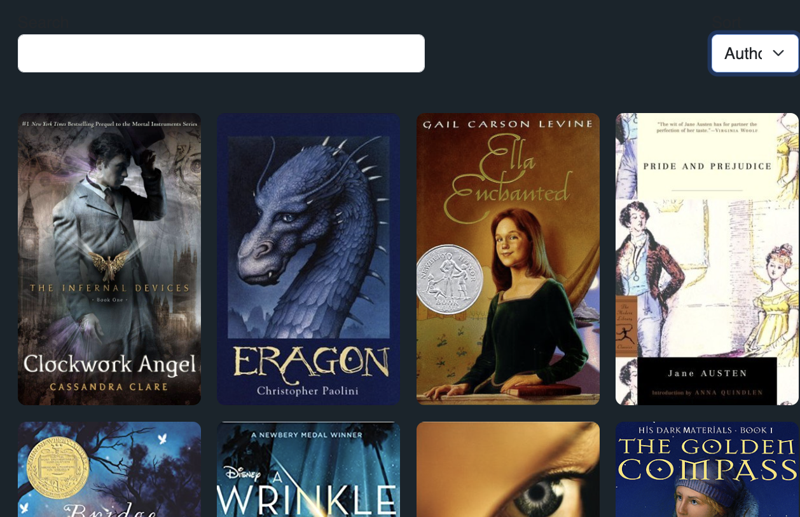

**Title:** Dropdown menu cuts off text in Sort component (BookshelfView)

**Description:**  
The dropdown menu in the Sort component (used in `BookshelfView.vue`) fails to fully display the text of its options. The **"Author"** and **"Rating"** options are partially cut off, making it unclear for users.

---

**Environment:**

- **Frontend:** Vue.js (Vite project)
- **Location:** `BookshelfView.vue` → `Sort.vue`
- **Browser:** All major browsers (observed in Chrome and Brave)

---

**Reproduction Steps:**

1. Launch the app locally (e.g., `localhost:5173`).
2. Navigate to the **Bookshelf view** (main page with the grid of books).
3. Locate the **Sort dropdown** near the top of the page.
4. Click to open the dropdown.
5. Look at the "Author" and "Rating" options.

---

**Actual Result:**

The dropdown menu’s width is too small to fully display the words **"Author"** and **"Rating"** — the text appears cut off.

---

**Expected Result:**

The dropdown should automatically resize or be wide enough to display the full text of all options **without truncation.**

---

**Screenshot:**



---

**Potential fix:**

Add the following style to the `.form-select` class in `Sort.vue`:

```html
style="min-width: 120px; width: auto;"
```
