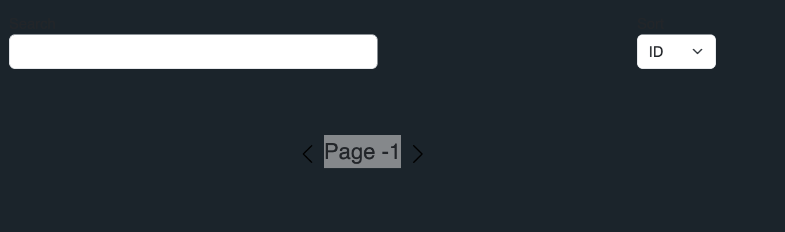

**Title:** Pagination component allows page number to drop below 1

**Description:**  
The pagination component allows the user to decrement the page number below 1 by clicking the previous page button. This results in the UI displaying "Page 0" or even negative numbers. Pagination should start at 1 according to user expectations.

---

**Environment:**

- **Location:** `BookshelfView.vue` → `Pagination.vue`
- **Browser:** All browsers

---

**Reproduction Steps:**

1. Launch the app locally (e.g., `localhost:5173`).
2. Navigate to the home page.
3. Scroll down to the pagination component.
4. Click the previous page button repeatedly.

---

**Actual Result:**

- The page number decrements below 1 ("Page 0", "Page -1", etc.).

---

**Expected Result:**

- The page number should not decrement below 1. When on page 1, the left (previous) button should either be disabled or hidden.

---

**Screenshot:**

