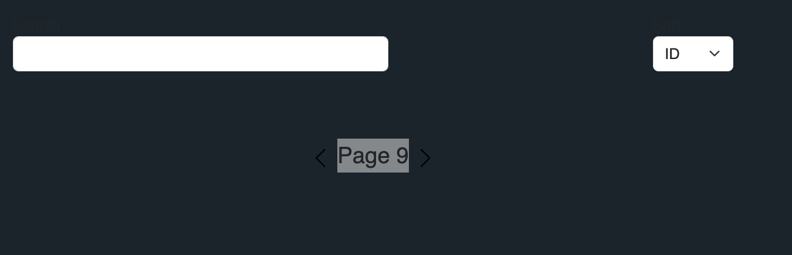

**Title:** Right pagination button is not disabled when the book list is over

**Description:**  
When there are no more books to display, the right (next) pagination button remains enabled. Clicking it leads the end user to empty pages (poor user experience).

---

**Steps to Reproduce:**

1. Launch the app locally (e.g., `localhost:5173`).
2. Navigate to the home page.
3. Scroll down to the pagination control at the bottom of the view.
4. Click the right arrow button until the book list is over.

---

**Expected Result:**

When the book list is over, the right (next) arrow should be disabled.

---

**Actual Result:**

The button remains active, allowing navigation to an empty page.

---

**Screenshot:**

