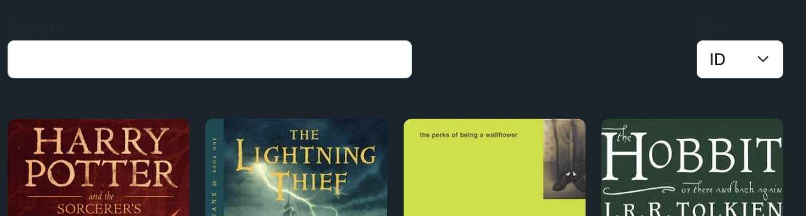

**Title:** Search text field is blank. No indication that the end user can search for

**Description:**  
The search input field is completely blank—there’s no placeholder text.

---

**Reproduction Steps:**

1. Launch the app (`localhost:5173`).
2. Go to the Home Page.
3. Check the search input field.

---

**Actual Result:**

The search input field is blank.

---

**Expected Result:**

A text (indication) should be displayed, e.g., "Search for a book..."

---

**Screenshot:**

